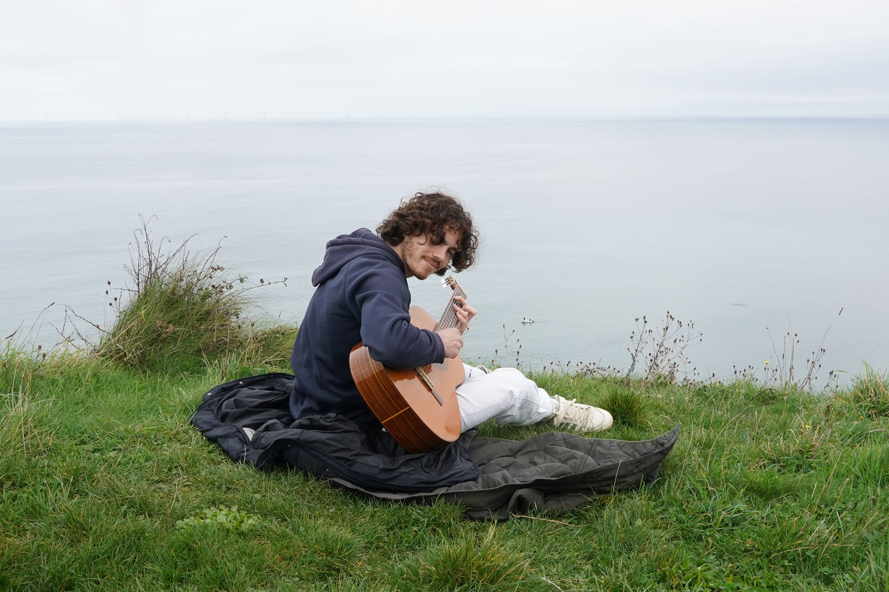

# Emilio Picard @ ENS Paris-Saclay | Sorbonne University

  

---

I'm currently a Master 2 student at **ENS Paris-Saclay**, specializing in **Mathematics** and **Programming** applied to **Machine and Deep Learning**.
Currently, my research interests are focused on applying `diffusion models` to music/audio processing !

🎶 Outside of academics, I'm a **Musician and composer**! You can check out my music on [Linktree](https://linktr.ee/soleer) (Spotify, Deezer, etc).

---
